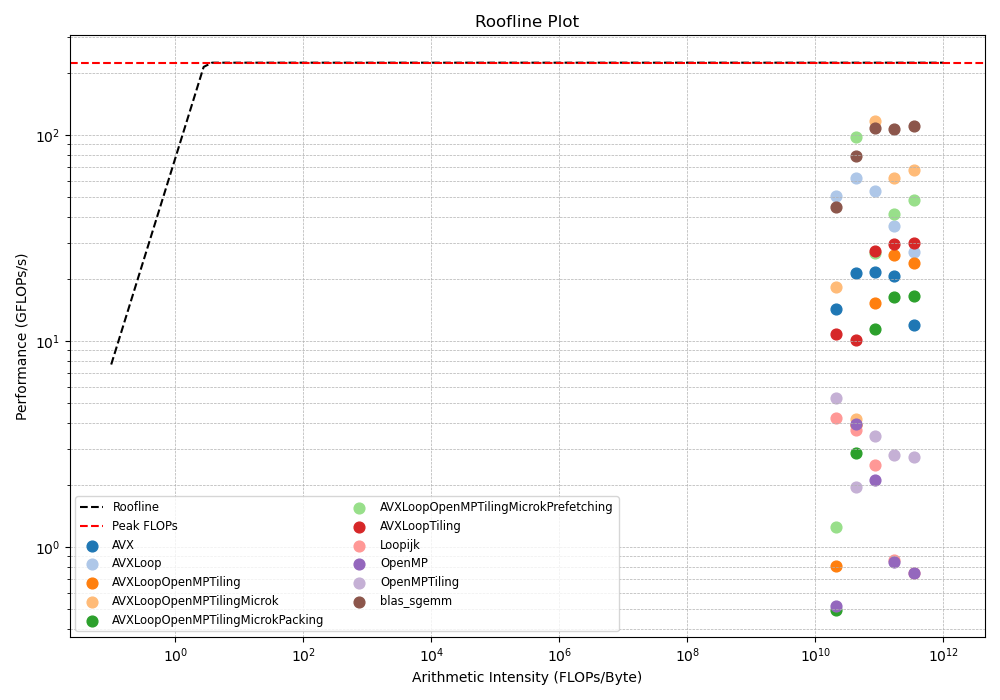

# Matrix Multiplication Optimization

This project implements matrix multiplication using various optimization techniques including **tiling**, **vectorization** (with AVX instructions), and **parallelization** (via OpenMP). The goal is to maximize performance by utilizing modern CPU features and memory hierarchies.

## Overview

Matrix multiplication is a fundamental operation in many scientific computing and machine learning applications. This project explores how to optimize this operation on modern hardware.

### Key Concepts:
1. **Standard Matrix Multiplication**: The basic operation where a matrix `C` is obtained by multiplying matrix `A` (of size `MxK`) with matrix `B` (of size `KxN`).
   
   \[
   C_{ij} = \sum_{k=0}^{K-1} A_{ik} \cdot B_{kj}
   \]

2. **Tiling**: Matrix multiplication performance can be improved by breaking the matrices into smaller "tiles" that fit better in the CPU cache, reducing memory access time.

3. **Vectorization**: Using AVX (Advanced Vector Extensions), we can perform multiple floating-point operations in parallel by loading multiple elements into SIMD (Single Instruction, Multiple Data) registers.

4. **Parallelization**: OpenMP is used to distribute the matrix multiplication work across multiple CPU cores, taking advantage of multi-core architectures.

---

## Features

- **Baseline Matrix Multiplication**: Implements the simple triple-loop algorithm.
- **Optimized Matrix Multiplication**:
  - **Tiling** to improve cache utilization.
  - **AVX vectorization** for faster floating-point operations.
  - **OpenMP parallelization** to utilize multiple CPU cores.
  
## Installation

To build and run the project, you'll need a C++ compiler that supports OpenMP and AVX instructions, such as `g++` or `clang++`. You can compile the code with the following command:

```bash
make
```
Note that the size of the matrix is fixed at compilation. To change the size of the matrix, you should refer to the commented out lines in 'benchmark.sh'

## Usage

Once compiled, you can run the program from the terminal. You can specify the matrix size as a command-line argument:

```bash
./matmul_Naiive
```

## Performance Analysis

To analyze the performance of the program, you can use tools like **Intel VTune**, **perf**, or custom timers built into the code. 

We provide a basic script to measure FLOPS and memory bandwidth using a roofline model.

## Example Results

Here are some performance metrics on an Intel Core i3 CPU:

- **Matrix Size**: `2048x2048`
- **Tile Size**: `128x128`
- **Performance**: `63 GFLOPS`

## Roadmap

- [x] Implement basic matrix multiplication.
- [x] Add AVX vectorization.
- [x] Introduce tiling to improve cache usage.
- [x] Add OpenMP for parallel processing.
- [ ] Extend to support GPU acceleration via CUDA.
- [x] Integrate roofline performance analysis.

## How Matrix Multiplication Works

Matrix multiplication involves taking the dot product of rows from the first matrix with columns from the second matrix. This project implements optimizations to enhance the speed of this computation by reducing memory access costs and taking advantage of hardware parallelism.

## Example Code Snippet

```cpp
#pragma omp parallel for shared(result, left, right) default(none) collapse(3)
for (int row = 0; row < rows; ++row) {
    for (int col = 0; col < columns; ++col) {
        for (int inner = 0; inner < inners; ++inner) {
            result[row * columns + col] += left[row * inners + inner] * right[inner * columns + col];
        }
    }
}
```

This code uses OpenMP for parallelizing the loops and performs a matrix multiplication operation.

## Benchmark Result on 11th Gen i3 @ 3.00GHz with 2 physical cores



## Contributions

Feel free to contribute by opening issues or submitting pull requests.

## License

This project is licensed under the MIT License.

---

### Resources
- [Introduction to the problem of Matrix Multiplication](https://marek.ai/matrix-multiplication-on-cpu.html)
- [Introduction to the problem of Matrix Multiplication (Si Boehm)](https://siboehm.com/articles/22/Fast-MMM-on-CPU)
- [Introduction to AVX/SIMD Instructions](https://blog.qiqitori.com/2018/04/baby-steps-in-simd-sseavx)
- [Qiqitori's blog on Matrix Multiplication](https://blog.qiqitori.com/2018/05/matrix-multiplication-using-simd-instructions/)
- [Intel VTune Profiler](https://software.intel.com/content/www/us/en/develop/tools/vtune.html)
- [Roofline Model Explanation](https://docs.nersc.gov/tools/performance/roofline/)
